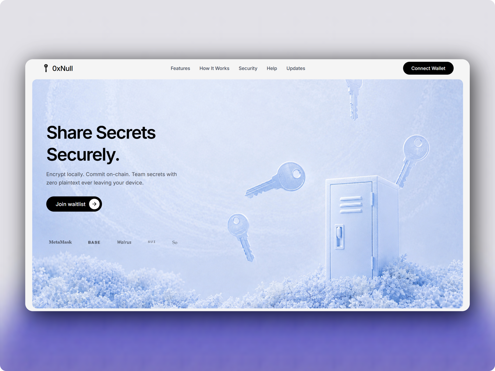

# 0xNull

A comprehensive Web3 application suite featuring a backend API, CLI tools, smart contracts, and multiple frontends.

## Project Structure

This monorepo contains the following components:

- **backend** - Node.js/TypeScript backend API with database integration
- **cli** - Command-line interface tools
- **contract** - Smart contracts and testing infrastructure
- **dapp** - Decentralized application frontend
- **web** - Marketing/landing page website with waitlist functionality

## Getting Started

### Prerequisites
- Node.js (v16 or higher)
- npm or yarn

### Installation

```bash
# Install dependencies for all packages
npm install
```

### Development

Each package can be run independently from its directory:

```bash
# Backend
cd backend && npm run dev

# CLI
cd cli && npm run dev

# Contract
cd contract && npm run test

# DApp
cd dapp && npm run dev

# Web
cd web && npm run dev
```

## Screenshots



## License

MIT
